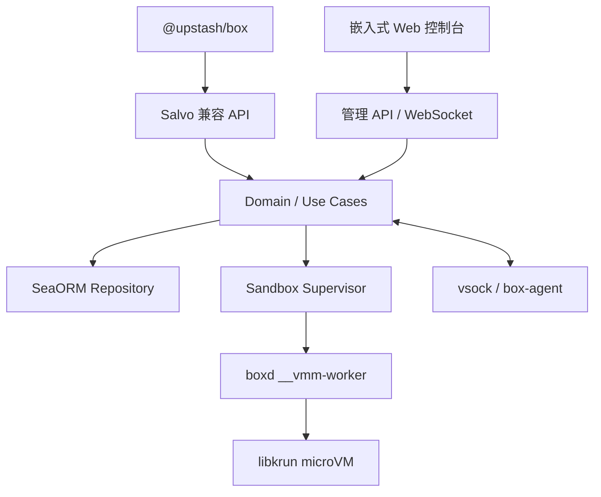
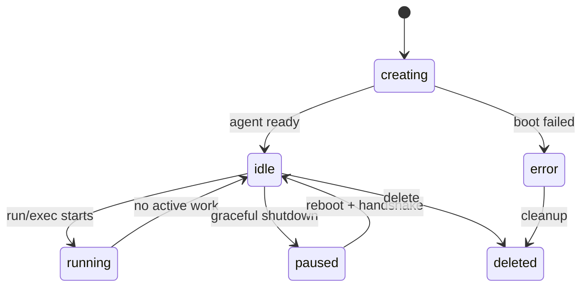

# Boxd：兼容 Upstash Box 的 macOS/Linux 沙盒即服务开发蓝图

> 文档状态：可执行开发基线
> 制定日期：2026-08-11
> 工作名称：`boxd`（后续可以替换产品名称）
> API 兼容基线：`@upstash/box 0.6.3`，源码 commit `677ca0827a6f54bc328b4b3e97d32a7cc5ac1934`
> 首发宿主平台：macOS 14+ Apple Silicon、Linux x86_64/aarch64 + KVM
> 暂不支持：Intel Mac、Windows、无硬件虚拟化的 Linux

## 1. 项目目标

开发一个用 Rust 编写的单节点沙盒即服务应用：

- 使用 Salvo.rs 提供 HTTP API、SSE、WebSocket、OpenAPI 和 Web 控制台入口。
- 对 `@upstash/box` 客户端保持线协议兼容，客户端只需替换 `baseUrl` 和 API Key，不需要 fork SDK。
- 每个 Box 运行在独立的 Linux microVM 中，而不是普通共享内核容器中。
- macOS Apple Silicon 使用 Hypervisor.framework，Linux 使用 KVM；首版统一由 libkrun 驱动。
- 默认使用 SQLite；通过数据库抽象和 SeaORM 支持后续切换 PostgreSQL/MySQL。
- 部署面只包含一个 `boxd` 可执行文件和一个 `boxd.toml` 配置文件。
- Web 控制台编译后嵌入 `boxd`，运行时不依赖 Node.js 或额外静态目录。
- 支持本地单用户模式，同时为远程服务、多 API Key、多租户和多节点调度预留模型。

### 1.1 “单文件 + 配置文件”的准确含义

交付物固定为：

```text
boxd
boxd.toml
```

运行后允许自动产生以下状态数据，它们不是部署依赖：

```text
data/
├── boxd.sqlite3
├── images/                 # 按需下载的 Linux runtime bundle
├── boxes/<box-id>/         # 每个 Box 的可写 raw disk
├── snapshots/<snapshot-id>/
├── recordings/
├── run/
└── embedded/               # 从 boxd 解出的已签名 libkrun/gvproxy 等内部资产
```

Linux kernel、rootfs 和语言运行时镜像不应全部塞进主程序，否则单文件会膨胀到数 GB。`boxd` 首次使用某个 runtime 时下载、校验、解压对应 bundle；离线环境使用 `boxd runtime import runtime.tar.zst` 提前导入。

libkrun 官方交付形态是动态库，因此发布构建将平台对应的动态库压缩嵌入 `boxd`，启动时校验 SHA-256 后解出到受控数据目录，再用 `libloading` 加载。macOS 发布物必须让主程序和嵌入动态库使用同一签名身份完成签名及 notarization。

## 2. 强制技术决策

| 领域 | 决策 |
|---|---|
| 主语言 | Rust stable，workspace 使用 Rust 2024 edition |
| HTTP | Salvo `0.95.x`，启用 `oapi`、`sse`、`websocket`、`serve-static`、`compression`、`cors`、`request-id`、`timeout` |
| 异步运行时 | Tokio |
| 默认数据库 | SQLite，WAL 模式、foreign keys、busy timeout |
| 数据访问 | SeaORM `2.0.x` + SeaORM Migration；编译 SQLite/PostgreSQL/MySQL 三种 driver |
| 配置 | TOML + 环境变量覆盖；`serde` + `figment` 或 `config-rs` |
| CLI | `clap` |
| 日志 | `tracing`、`tracing-subscriber`，JSON/pretty 两种格式 |
| 指标 | Prometheus 文本格式；可选 OpenTelemetry |
| VMM | libkrun `v1.19.4`，禁止跟随不稳定 `main/2.0` API |
| microVM 通信 | virtio-vsock；宿主为每个 Box 建立 Unix socket |
| Guest RPC | Protobuf + Tonic 双向流，协议显式版本化 |
| VM 磁盘 | 每 Box 独立 raw ext4 磁盘；禁止用宿主目录作为默认 rootfs/workspace |
| 快照 | guest quiesce + APFS clonefile/Linux reflink；不支持时停机 sparse copy |
| Web 控制台 | React + TypeScript + Vite + Ant Design；产物用 `rust-embed` 嵌入 |
| ID | UUIDv7 字符串 |
| 时间 | 数据库存 UTC epoch milliseconds；兼容 API 按 SDK 字段要求输出 epoch seconds |
| 密钥加密 | XChaCha20-Poly1305；API Key 用带 master key 的 HMAC-SHA-256 索引 |

Salvo 当前支持内置 OpenAPI、SSE、WebSocket 和嵌入静态资源，适合在一个 HTTP 进程里同时提供兼容 API 与控制台。SeaORM 的连接层原生接受 `sqlite:`、`postgres:` 和 `mysql:` URL，因此数据库后端不得写死在 handler 或 domain service 中。

## 3. 系统架构



### 3.1 进程模型

`boxd serve` 是长期控制面进程。每个活跃 Box 使用同一个可执行文件启动一个隐藏子命令：

```text
boxd serve
├── boxd __vmm-worker --spec-fd <fd>     # Box A
├── boxd __vmm-worker --spec-fd <fd>     # Box B
└── boxd __vmm-worker --spec-fd <fd>     # Box C
```

必须使用子进程，而不是在 API 进程内部直接调用 `krun_start_enter()`。libkrun 稳定 API 的该函数会消费配置、接管运行，并在 VM 停止时调用 `exit()`；直接嵌入 API 进程会导致整个服务退出。

每个 worker 只负责：加载平台对应 libkrun；设置 vCPU、内存、raw disk、console、vsock 和网络；启动 microVM；将 VM 退出原因通过退出码和控制管道反馈给 supervisor。业务请求、状态机、数据库和 RPC 连接都由主进程持有。

### 3.2 VMM 抽象

必须先定义抽象，再实现 libkrun：

```rust
#[async_trait]
pub trait SandboxDriver: Send + Sync {
    async fn capabilities(&self) -> DriverCapabilities;
    async fn prepare(&self, spec: &SandboxSpec) -> Result<PreparedSandbox>;
    async fn start(&self, prepared: &PreparedSandbox) -> Result<RunningSandbox>;
    async fn request_shutdown(&self, id: SandboxId, grace: Duration) -> Result<()>;
    async fn force_stop(&self, id: SandboxId) -> Result<()>;
    async fn inspect(&self, id: SandboxId) -> Result<RuntimeState>;
    async fn cleanup(&self, id: SandboxId) -> Result<()>;
}
```

首版实现 `LibkrunDriver`。以后可以增加 `FirecrackerDriver`，但不得让 Firecracker 的 REST socket、设备模型或 snapshot 类型泄漏到 domain/API 层。

## 4. 支持平台与启动检查

### 4.1 macOS

- 最低 macOS 14，只支持 Apple Silicon ARM64。
- 主程序必须带 `com.apple.security.hypervisor=true` entitlement 并完成代码签名。
- 使用 libkrun HVF 后端。
- 数据目录默认 `~/Library/Application Support/boxd/`。
- APFS 上优先使用 `clonefile()` 创建 Box 和 snapshot。

### 4.2 Linux

- 支持 x86_64/aarch64，必须存在可读写 `/dev/kvm`。
- 推荐 kernel 6.1+、cgroup v2。
- 数据目录默认 `/var/lib/boxd/`；非 root 本地模式使用 `$XDG_DATA_HOME/boxd/`。
- worker 加入独立 cgroup，限制内存、CPU、PID、打开文件数。
- 优先使用 `FICLONE`/reflink；文件系统不支持时使用 sparse copy，并记录性能警告。

### 4.3 `boxd doctor`

必须检查并给出可操作错误：CPU/宿主支持；macOS entitlement/签名；Linux `/dev/kvm`、KVM module、cgroup v2、TUN；数据目录空间与 CoW；libkrun 版本和 BLK/NET/vsock feature；runtime 签名/checksum；数据库迁移；listen/public/preview URL 自洽性。

## 5. 仓库结构

```text
boxd/
├── Cargo.toml
├── Cargo.lock
├── rust-toolchain.toml
├── AGENTS.md
├── README.md
├── config/boxd.example.toml
├── crates/
│   ├── boxd/                       # 唯一宿主可执行程序、CLI、composition root
│   ├── box-core/                   # domain、ports、use cases、状态机
│   ├── box-api/                    # Salvo compatibility/admin routers
│   ├── box-db/                     # SeaORM entities/repositories
│   ├── box-migration/              # 三数据库通用迁移
│   ├── box-runtime/                # SandboxDriver、Supervisor
│   ├── box-runtime-libkrun/        # FFI、worker spec、平台适配
│   ├── box-agent-proto/            # protobuf 与生成代码
│   ├── box-agent/                  # guest 内 PID 1/service
│   ├── box-image/                  # runtime 下载、校验、clone
│   ├── box-preview/                # HTTP/WS/TCP tunnel
│   ├── box-scheduler/              # cron、webhook、lease
│   ├── box-browser/                # Chromium/CDP/recording
│   └── box-secrets/                # 加密与 redaction
├── proto/box_agent_v1.proto
├── web/console/                    # React/Vite/Ant Design
├── images/{build,manifests,guest}/
├── compat/
│   ├── upstash-box-0.6.3.yaml
│   └── node-tests/
├── tests/{contract,integration,security}/
└── docs/
    ├── architecture.md
    ├── api-compatibility.md
    ├── runtime-bundle.md
    ├── threat-model.md
    └── implementation-status.md
```

禁止把所有逻辑堆到 `main.rs`。Salvo handler 只能做 DTO 解析、鉴权、调用 use case 和响应映射，不允许直接操作 SeaORM entity、磁盘或 libkrun。

## 6. 配置文件规范

```toml
version = 1

[server]
listen = "127.0.0.1:7331"
public_url = "http://127.0.0.1:7331"
graceful_shutdown_seconds = 30
request_body_limit_mb = 128
trusted_proxies = []

[database]
url = "sqlite://./data/boxd.sqlite3?mode=rwc"
auto_migrate = true
max_connections = 10
min_connections = 1
connect_timeout_seconds = 10

[auth]
enabled = true
bootstrap_admin_user = "admin"
bootstrap_admin_password_env = "BOXD_ADMIN_PASSWORD"
master_key_env = "BOXD_MASTER_KEY"
api_key_header = "X-Box-Api-Key"
session_ttl_seconds = 43200

[storage]
data_dir = "./data"
images_dir = "./data/images"
boxes_dir = "./data/boxes"
snapshots_dir = "./data/snapshots"
recordings_dir = "./data/recordings"
minimum_free_gib = 10

[runtime]
driver = "libkrun"
libkrun_version = "1.19.4"
bundle_registry = "https://releases.example.com/boxd/runtimes"
auto_pull = true
verify_signatures = true
agent_vsock_port = 18080
boot_timeout_seconds = 30
shutdown_timeout_seconds = 10

[resources]
max_running_boxes = 4
max_total_memory_mib = 16384
max_total_vcpus = 8
default_disk_gib = 20

[resources.profiles.small]
vcpus = 2
memory_mib = 4096

[resources.profiles.medium]
vcpus = 4
memory_mib = 8192

[resources.profiles.large]
vcpus = 8
memory_mib = 16384

[network]
default_policy = "allow-all"
dns_servers = ["1.1.1.1", "8.8.8.8"]
allow_private_cidrs = false

[preview]
mode = "path"
base_url = "http://127.0.0.1:7331"
path_prefix = "/p"
wildcard_domain = ""

[console]
enabled = true
base_path = "/console"

[observability]
log_format = "pretty"
log_level = "info"
metrics_enabled = true
metrics_path = "/metrics"

[features]
browser = true
schedules = true
custom_network_policy = false
attach_headers = false
```

规则：配置优先级为内置默认值 < TOML < `BOXD__SECTION__KEY` 环境变量 < CLI；支持 `boxd config validate`；任何输出不得暴露 secret；数据库切换只改 URL；SQLite 开 WAL、foreign_keys 和 busy timeout，且只允许单服务实例。

## 7. 数据模型

SeaORM migration 必须同时通过 SQLite、PostgreSQL、MySQL。避免专属 JSON、数组、partial index 和 trigger；JSON 用 canonical text。

| 表 | 关键字段 |
|---|---|
| `accounts` | `id`, `name`, `status`, timestamps |
| `users` | account、username、password hash、role |
| `api_keys` | account、prefix、key_hmac、scopes、last_used/expiry |
| `nodes` | platform、arch、capabilities、heartbeat |
| `boxes` | account/node/name/runtime/size/status/ephemeral/expiry/keep_alive/browser/disk/model/agent/counters/version/timestamps |
| `box_labels` | box_id + label 联合唯一 |
| `box_secrets` | box_id、kind、name、ciphertext、nonce |
| `runs` | box/schedule/type/status/prompt/output/error/token/cpu/memory/cost/session/timestamps |
| `run_events` | run、sequence、event_type、payload_json |
| `snapshots` | box、name、status、disk、size、checksum |
| `schedules` | SDK 字段 + next_run/lease |
| `previews` | box、port、auth、token HMAC |
| `runtime_images` | runtime、arch、version、manifest/path/checksum/status |
| `browser_recordings` | SDK Recording 字段、playlist/path/markers/retention |
| `operations` | 长任务状态、幂等键、重试、错误 |
| `audit_logs` | actor/action/resource/request/IP/metadata |

Box/Snapshot 使用 UUIDv7；`boxes.version` optimistic locking；API Key 只显示一次且不存明文；secret 加密；兼容输出中的 `customer_id` 映射 account ID。

## 8. Box 状态机与恢复

兼容状态集合：

```text
creating | idle | running | paused | error | deleted
```



- create 先返回 creating，SDK 会每 2 秒轮询，5 分钟内必须结束创建态。
- Ephemeral create 同步等待 ready；响应有 `ephemeral`/`expires_at`；默认/最大 TTL 259200 秒。
- pause=agent flush + guest shutdown + 停 worker + 保留盘，释放内存；resume 重启并握手。
- keep-alive 拒绝 pause，启动后运行 init command。
- 删除幂等；清理失败后台重试。
- 重启 reconciliation 核对 DB、PID/start time、socket、agent；失联实例恢复或 error。
- lifecycle 操作使用 per-box mutex + optimistic lock。

## 9. Runtime bundle 与磁盘

接受十种 runtime：`node/python/golang/ruby/rust` 及对应 `-alpine`；ARM64/x86_64 均构建。bundle 格式：

```text
box-runtime-node-arm64-<version>.tar.zst
├── manifest.json
├── manifest.sig
├── rootfs.raw
├── sbom.spdx.json
└── licenses/
```

manifest 包含格式版本、runtime、arch、kernel/libkrun 兼容、rootfs size、agent protocol、checksum、构建工具链。rootfs 包含精简 Linux、root box-agent、普通 boxuser、`/workspace/home`、git/CA/常用工具、对应语言、可选 Chromium 和固定版本 harness CLI。

base raw 永远只读；create 克隆为 Box 私有 raw；所有用户写入在 guest disk；默认禁止宿主目录共享。snapshot：锁 → quiesce/sync → 阻止新写 → CoW clone/sparse copy → checksum → 恢复。首版允许短暂停机确保一致性。fromSnapshot 只克隆，不改原盘。所有删除先 canonicalize 并验证目标属于数据根。

## 10. box-agent 协议

guest 监听 vsock `18080`；worker 通过 `krun_add_vsock_port2(..., listen=true)` 映射到 `data/run/<box-id>/agent.sock`；host 用 Tonic/HTTP2 连接。握手包含协议版本、box ID、boot nonce、runtime、arch、agent version/capabilities；nonce 不符拒绝。心跳 5 秒，连续三次失败触发恢复。

```protobuf
service BoxAgentV1 {
  rpc Health(HealthRequest) returns (HealthResponse);
  rpc Exec(ExecRequest) returns (stream ExecFrame);
  rpc Cancel(CancelRequest) returns (CancelResponse);
  rpc ReadFile(ReadFileRequest) returns (stream BytesFrame);
  rpc WriteFile(stream WriteFileFrame) returns (WriteFileResponse);
  rpc ListFiles(ListFilesRequest) returns (ListFilesResponse);
  rpc Git(GitRequest) returns (stream ExecFrame);
  rpc RunHarness(RunHarnessRequest) returns (stream HarnessEvent);
  rpc Quiesce(QuiesceRequest) returns (QuiesceResponse);
  rpc Shutdown(ShutdownRequest) returns (ShutdownResponse);
  rpc Dial(stream TunnelFrame) returns (stream TunnelFrame);
  rpc Browser(BrowserRequest) returns (stream BrowserFrame);
  rpc Stats(StatsRequest) returns (stream StatsFrame);
}
```

Exec 内部传 argv；只有 SDK command string 转 `sh -c`。cwd 防 `..`/symlink escape。每次运行绑定 PID/PGID；cancel 先 TERM 后 KILL。stdout/stderr 独立并带 sequence/backpressure。写文件 temp+fsync+atomic rename。普通命令以 boxuser 执行，不暴露 root shell。

## 11. Upstash Box API 完整兼容契约

### 11.1 固定基线

真相源：[`client.ts`](https://github.com/upstash/box/blob/677ca0827a6f54bc328b4b3e97d32a7cc5ac1934/packages/sdk/src/client.ts)、[`types.ts`](https://github.com/upstash/box/blob/677ca0827a6f54bc328b4b3e97d32a7cc5ac1934/packages/sdk/src/types.ts)、[`custom-harness.ts`](https://github.com/upstash/box/blob/677ca0827a6f54bc328b4b3e97d32a7cc5ac1934/packages/sdk/src/custom-harness.ts)。全部路由用 `/v2/box`、`X-Box-Api-Key`、snake_case；错误至少 `{error:string}`；管理行为不放该前缀。

### 11.2 路由清单

#### Box、设置与生命周期

| Method | Path | 功能 |
|---|---|---|
| POST/GET/DELETE | `/v2/box` | create/list/body `{ids}` 批量删除 |
| POST | `/v2/box/from-snapshot` | 从 snapshot 创建 |
| GET/DELETE | `/v2/box/{box_id}` | get/delete |
| GET | `/v2/box/{box_id}/status` | status |
| POST | `/v2/box/{box_id}/pause`、`resume` | pause/resume |
| GET/PUT/DELETE | `/v2/box/{box_id}/startup` | init command |
| PUT | `/v2/box/{box_id}/config/model` | model |
| PUT | `/v2/box/{box_id}/config/custom-runner` | custom harness |
| PUT | `/v2/box/{box_id}/config/network-policy` | network policy |
| POST/DELETE | `/v2/box/{box_id}/config/skills[/{skill_id...}]` | skill；ID 尾部允许斜杠 |
| POST/DELETE | `/v2/box/{box_id}/config/labels[/{label}]` | label |
| GET/PUT | `/v2/box/settings/env` | stored env list/bulk update |
| PUT/DELETE | `/v2/box/settings/env/{key}` | stored env set/delete |

#### Run、exec、code 与日志

| Method | Path | 功能 |
|---|---|---|
| POST | `/v2/box/{box_id}/run` | webhook/fire-and-forget |
| POST | `/v2/box/{box_id}/run/stream` | agent SSE，JSON/multipart |
| POST | `/v2/box/{box_id}/runs/{run_id}/cancel` | cancel |
| GET | `/v2/box/{box_id}/runs` | list runs |
| GET | `/v2/box/{box_id}/logs?limit=&source=` | logs |
| POST | `/v2/box/{box_id}/exec`、`exec-stream` | command/stream |
| POST | `/v2/box/{box_id}/code`、`code-stream` | js/ts/python |

#### Files、Git 与 Snapshot

| Method | Path | 功能 |
|---|---|---|
| GET | `/v2/box/{box_id}/files/read?path=&encoding=` | read |
| POST | `/v2/box/{box_id}/files/write` | write |
| GET | `/v2/box/{box_id}/files/list?folder=` | list |
| POST | `/v2/box/{box_id}/files/upload` | multipart paths/files |
| GET | `/v2/box/{box_id}/files/download?folder=` | binary download |
| POST | `/v2/box/{box_id}/git/clone`、`commit`、`push`、`create-pr`、`exec`、`checkout` | Git 写操作 |
| GET | `/v2/box/{box_id}/git/diff`、`status` | Git 读取 |
| PUT | `/v2/box/{box_id}/git-config` | Git identity |
| POST/GET | `/v2/box/{box_id}/snapshots` | create/list |
| DELETE | `/v2/box/{box_id}/snapshots/{snapshot_id}` | delete one |
| DELETE | `/v2/box/snapshots` | `{ids?:[]}` selected/all |

#### Schedules 与 Preview

| Method | Path | 功能 |
|---|---|---|
| POST/GET | `/v2/box/{box_id}/schedules` | create/list |
| GET/PATCH/DELETE | `/v2/box/{box_id}/schedules/{id}` | get/update/delete |
| POST | `/v2/box/{box_id}/schedules/{id}/pause`、`resume` | pause/resume |
| POST/GET | `/v2/box/{box_id}/preview` | create/list public URL |
| DELETE | `/v2/box/{box_id}/preview/{port}` | delete public URL |

#### Browser 与 Recording

| Method | Path | 功能 |
|---|---|---|
| POST/GET | `/v2/box/{box_id}/browser/tabs` | create/list tabs |
| DELETE | `/v2/box/{box_id}/browser/tabs/{tab_id}` | close tab |
| POST | `/v2/box/{box_id}/browser/goto`、`extract`、`observe`、`act`、`run` | browser actions |
| GET | `/v2/box/{box_id}/browser/content`、`screenshot` | content/image |
| POST | `/v2/box/{box_id}/browser/connect`、`screencast` | CDP/live URL |
| POST | `/v2/box/{box_id}/browser/recordings`、`recordings/stop` | start/stop |
| GET | `/v2/box/{box_id}/browser/recordings` | paginated list |
| GET | `/v2/box/{box_id}/browser/recordings/{id}` | metadata |
| GET | `/v2/box/{box_id}/browser/recordings/{id}/playlist` | HLS |
| GET | `/v2/box/{box_id}/browser/recordings/{id}/download` | MP4/MPEG-TS |

### 11.3 Create 与资源规则

接受 name、labels、size、keep_alive、init_command、model、agent、agent_api_key、custom_runner、runtime、browser、github_token、git identity、env_vars、attach_headers、network_policy、skills、mcp_servers、ephemeral、ttl、snapshot_id。size 默认/映射：small=2 vCPU/4096 MiB，medium=4/8192，large=8/16384；资源不足返回 422，不能静默缩水。label 最多 5 个、每个 20 字符，只允许字母数字和 `._-:`。

### 11.4 Agent SSE

事件：`run_start` `{run_id}`、`text` `{text}`、`thinking` `{text}`、`tool` `{tool_call_id,name,input}`、`tool_result` `{tool_call_id,output}`、`stats` `{cpu_ns,memory_peak_bytes}`、`done` `{output,input_tokens,output_tokens,cached_input_tokens,total_cost_usd,session_id}`、`error` `{error}`。

响应使用 `text/event-stream`、no-cache、keep-alive、`X-Accel-Buffering:no`，禁压缩/缓冲。客户端断开=detached，除非 cancel 不自动杀 run。

### 11.5 Exec/code stream

先原样输出 stdout/stderr，结尾追加 SSE `event: exit` 和 JSON `{exit_code,cpu_ns}`；错误追加 `event: error` 和 `{error}`。普通输出不得包装成 `data:`。

### 11.6 Custom harness

启动形式：`<command> <args...> -p <prompt> --model <model> --stream [--session <id>]`。只接受 `box-sse-v1`；stdout 使用 text/thinking/tool/tool_result/done/error SSE；stderr 进日志但不得污染协议。command 只允许 PATH，或 `/workspace/home`、`/home/boxuser` 下 canonical path。

## 12. Agent harness 实现

### 12.1 默认 harness

运行时镜像内置 `box-harness`，负责把模型调用和工具调用转换成 11.4 的 SSE。服务端只负责注入当前 box、run、model、secret 引用和 session，不在宿主机直接执行模型生成的命令。

最小工具集合：

- `shell`：通过 guest agent 执行命令；
- `read_file`、`write_file`、`list_files`：路径限制在 workspace；
- `git`：调用镜像内 git；
- `browser`：仅 browser runtime 可用；
- `mcp`：由配置的 MCP server 白名单动态注册。

session 数据保存在 box 数据盘的 `/var/lib/boxd/sessions`，数据库只保存索引和使用量。模型密钥通过临时文件或 pipe 注入，禁止出现在 argv、日志、事件表和快照元数据中。

### 12.2 Run 生命周期

1. API 事务创建 `runs(status=queued)`；
2. 调度器获取 box 互斥租约，将状态切为 running；
3. 启动 harness 并把事件同时写入内存广播与 `run_events`；
4. SSE 订阅者消费实时事件；重连时先按 event id 回放数据库事件；
5. 收到 `done/error` 或进程退出，原子更新 run 与 box 状态；
6. cancel 设置取消标志并向 guest 发送 TERM，超时后 KILL。

每个事件都有单调递增 `sequence`；落库与推流前必须经过 secret redactor。首版每个 box 只允许一个 agent run，但 exec 可按配置选择串行或受限并行。

### 12.3 模型适配

定义 `ModelProvider` trait，首版实现 OpenAI-compatible HTTP provider；provider base URL、模型别名和凭据只出现在管理配置。API 中的 `model` 原样保留，服务端使用映射表解析。所有 HTTP 请求必须有 connect/read/total timeout、指数退避、429/5xx 限次重试和取消传播。

## 13. 网络、Preview 与 attach headers

### 13.1 基础网络

libkrun 的 TSI 提供 guest 出站和宿主端口映射。每个 box 分配内部 vsock CID，端口发布由 control plane 持有，不允许 guest 任意绑定宿主端口。

默认策略：允许 DNS、HTTP/HTTPS 出站，拒绝访问宿主控制 API、云元数据地址、环回/链路本地和配置的私有网段。由于稳定版 libkrun 没有完整的逐域名策略接口，不能把“未实现过滤”标成兼容：

- MVP 的 `network_policy` 只接受默认策略和 deny-all；
- 完整 allow/deny domain、CIDR、port 进入 GA 前，选择并固化一种实现：维护一个小型 libkrun 网络 hook 补丁，或引入用户态 virtio-net/proxy；
- 不支持的规则返回 501 `feature_not_supported`，不得接受后忽略。

所有 DNS 解析结果都再次经过 CIDR 检查，以降低 DNS rebinding 风险；连接时记录 tenant、box、目标类别和判定，不记录敏感 query/body。

### 13.2 Preview

`POST .../preview` 验证目标 port 后创建随机、带过期时间的 signed token。网关路由：

```text
GET /p/{preview_token}/{*path}
    -> validate token and box ownership
    -> host-to-guest vsock TCP bridge
    -> guest 127.0.0.1:{port}
```

支持 HTTP/1.1、WebSocket upgrade、流式响应；对 Host、Forwarded、X-Forwarded-* 做覆盖而非拼接。公网 preview 默认 30 分钟，控制台可撤销；不允许直接暴露 control/agent vsock 端口。

### 13.3 attach_headers

语义是给 box 发出的匹配域名请求附加 header。实现必须位于透明 egress proxy，规则按最具体域名优先，禁止覆盖 `Host`、`Content-Length` 和 hop-by-hop header；值加密存储并在日志中打码。TLS 目标若要求修改 header，需要明确的受控 MITM/自签 CA 方案；在该能力完整实现前对 HTTPS attach_headers 返回 501，不能误报成功。

## 14. Browser runtime

Browser box 使用单独 runtime bundle，内置 Chromium、字体、Playwright driver 与 `browserd`。`browserd` 只监听 vsock，control plane 不直接暴露 CDP。

实现顺序：tabs/goto/content/screenshot → extract/observe/act/run → connect/screencast → recording。关键约束：

- tab id 为服务端 opaque id，不暴露可猜测的 Chromium target id；
- URL 导航复用网络策略，阻断 `file:`、`chrome:`、metadata、私网 SSRF；
- screenshot、trace、download、recording 有单文件和租户总配额；
- `connect` 返回短期、单 box、单用途 token；
- screencast 有帧率、分辨率、带宽上限和背压；
- recording 使用 HLS 分片，stop 后异步封装下载文件；
- browser 行为保留结构化审计，但默认不保存页面正文和输入框内容。

外部 API DTO 必须对照 SDK `types.ts` 写固定 JSON fixture；内部 Playwright 类型不得穿透 API。

## 15. 调度、并发与配额

单机版本内置 Tokio scheduler；多节点版本再拆出调度租约，HTTP API 不变。

- 启动时扫描 `creating/running/paused` 的 box 和未结束 run，按心跳/worker pid 恢复或标记 error；
- 每个 box 使用数据库 lease + 进程内 mutex，避免 resume/delete/run 竞态；
- SQLite 模式只支持一个 active control-plane 进程；PostgreSQL/MySQL 模式可用数据库 advisory/lease 实现多节点；
- 资源准入以物理 CPU、可用内存、磁盘和配置 overcommit 比率计算；
- API key 有 requests/minute、并发 run、box 数、磁盘和流量配额；
- ephemeral box 到 TTL 后进入 deleting；keep_alive 空闲到期只关机、不删除持久数据；
- schedule 使用 UTC cron，保存用户时区，仅一个 lease holder 触发；幂等键为 `schedule_id + scheduled_at`。

## 16. Salvo HTTP 服务组织

### 16.1 Router

```text
Service
├── /health/live
├── /health/ready
├── /metrics
├── /v2/box                    Upstash compatibility router
├── /api/admin/v1              management router
├── /console/{*path}           embedded SPA
└── /p/{token}/{*path}         preview proxy
```

推荐 middleware 顺序：request id → trusted proxy normalization → body limit → auth → rate limit → tenant context → tracing → handler → error mapper → security headers。SSE/WebSocket 路由关闭响应压缩和全量 body logging。

### 16.2 API 内部层次

handler 只完成认证、DTO 解码和响应编码；application service 处理事务与权限；domain 层实现状态机；repository 使用 SeaORM；runtime driver 负责 VM/agent。禁止 handler 直接拼 SQL 或调用 libkrun FFI。

```rust
#[async_trait]
pub trait SandboxRuntime: Send + Sync {
    async fn create(&self, spec: SandboxSpec) -> Result<RuntimeRef>;
    async fn start(&self, id: &RuntimeRef) -> Result<()>;
    async fn stop(&self, id: &RuntimeRef, grace: Duration) -> Result<()>;
    async fn delete(&self, id: &RuntimeRef) -> Result<()>;
    async fn exec(&self, id: &RuntimeRef, req: ExecRequest) -> Result<ExecStream>;
    async fn expose_port(&self, id: &RuntimeRef, port: u16) -> Result<PortBridge>;
    async fn snapshot(&self, id: &RuntimeRef) -> Result<SnapshotRef>;
}
```

### 16.3 错误映射

所有兼容 API 错误返回 JSON，至少含稳定 `error`、人类可读 `message`、`request_id`；若 SDK 对字段/状态码有既有假设，以黑盒 fixture 为准。建议映射：400 validation、401 auth、403 tenant/policy、404 object、409 state conflict、413 limit、422 capacity、429 quota、500 internal、501 unsupported、503 unavailable。

### 16.4 OpenAPI

管理 API 由 Salvo OpenAPI 自动生成；兼容 API 的 OpenAPI 由 DTO 注解生成后，还要与手工维护的 compatibility manifest 比对。OpenAPI 不是唯一真相，SDK contract tests 才是发布门禁。

## 17. Web 控制台

前端采用 React + TypeScript + Vite + Ant Design，产物通过 `rust-embed` 编进 boxd；浏览器访问 `/console`，刷新由 SPA fallback 处理。前端只调用 `/api/admin/v1`，不复用兼容 API key。

首版页面：

1. 登录与首次初始化管理员；
2. Dashboard：运行 box、CPU/内存/磁盘、失败任务；
3. Boxes：创建、状态、暂停/恢复/删除、terminal、文件、env、labels；
4. Runs：prompt、实时事件、日志、cancel；
5. Snapshots 与 runtime images；
6. Schedules；
7. API keys、用户、配额；
8. System：节点、配置只读视图、审计、诊断包。

terminal 使用 WebSocket，服务端签发 60 秒单用途会话票据；剪贴板和文件上传需要显式权限。所有 destructive 操作二次确认并显示 box id。凭据页面只在创建时展示一次明文。

控制台认证首版为本地账户 + Argon2id + secure/HttpOnly/SameSite cookie + CSRF token；预留 OIDC。管理会话和 `X-Box-Api-Key` 使用独立认证链。

## 18. 安全基线

- VM 隔离是主要安全边界；guest 进程使用非 root `boxuser`，rootfs 基础层只读，workspace 数据盘可写；
- 不把宿主目录以 virtiofs 直接共享给不可信代码，文件操作经 agent 或独立数据盘；
- libkrun worker 进程使用最小环境、独立工作目录、no-new-privileges、资源限制；Linux 再加 systemd sandbox/seccomp，macOS 使用专用服务账户；
- API key 仅保存带 pepper 的 hash 和前缀；secret/env value 使用 AEAD envelope encryption，主密钥来自配置引用或环境变量；
- 禁止 secret 出现在 tracing fields、panic、数据库错误、SSE、快照 manifest 和诊断包；
- 上传文件校验路径、大小、解压比和 symlink；所有 guest path 用 canonical/dirfd 风格解析，防止 `../` 和 symlink race；
- git token 使用 askpass 临时注入，清理 remote URL；
- runtime image、box-agent 和内嵌 libkrun 都校验 SHA-256，正式发行再校验签名；
- HTTP 设置 HSTS（TLS 时）、CSP、frame-ancestors、nosniff、严格 CORS；
- preview 与控制台 cookie 域隔离，生产推荐不同 hostname；
- 审计 create/delete/key/secret/policy/preview/admin 操作，记录 actor、tenant、target、result、request id。

威胁模型必须覆盖：恶意 guest 逃逸、SSRF/metadata、tenant 越权、API key 泄漏、preview 接管、磁盘快照残留、日志泄密、压缩炸弹、资源耗尽、供应链镜像替换。

## 19. 可观测性与运维

使用 tracing + JSON logs，支持 OTLP；Prometheus 指标至少包括 HTTP latency/status、active boxes、VM boot time、run duration、SSE clients、guest RPC errors、scheduler lag、disk bytes、preview traffic、runtime image pulls。

健康检查：

- `/health/live`：事件循环可响应；
- `/health/ready`：数据库、data dir、libkrun、KVM/HVF、agent runtime bundle 均可用；
- `boxd doctor --json`：输出机器可读诊断与建议，但隐藏 secret。

日志轮转由内置 rolling appender 或 stdout 交给服务管理器；审计日志单独保留。每个 HTTP、operation、run 和 guest RPC 传播同一个 request/trace id。

## 20. 测试与兼容性验收

### 20.1 测试层次

1. unit：状态机、validation、路径、配额、配置解析；
2. repository integration：同一套用例跑 SQLite、PostgreSQL、MySQL；
3. agent protocol：host/guest protobuf version 和错误注入；
4. runtime integration：macOS HVF、Linux KVM 各自 CI/self-hosted runner；
5. API contract：真实 `@upstash/box@0.6.3` 客户端指向本地 `baseUrl`；
6. differential：同一请求分别打官方服务与 boxd，归一化 id/time 后比较 status、headers、JSON/SSE；
7. security：越权矩阵、SSRF、path traversal、secret redaction、资源耗尽；
8. console E2E：Playwright 覆盖核心管理流。

### 20.2 SDK contract fixture

在 `compat/upstash-box-0.6.3/` 固定：npm lockfile、调用脚本、输入 fixtures、预期 canonical responses、SSE parser tests 和 route manifest。测试只能通过公开 SDK 调用，禁止为 boxd 写旁路。

至少覆盖：

- 全部 69 个 SDK HTTP 调用点的 method/path/query/body/header；
- create/list/get/status/pause/resume/delete；
- exec/code 的 stdout、stderr、非零退出、timeout、cancel；
- agent run 全部 SSE event、断线重连、自定义 harness；
- 文件二进制/Unicode/大文件/路径攻击；
- git、snapshot、schedule、preview；
- browser 全路由；
- 401/404/409/413/422/429/501 和 SDK 抛错形态。

### 20.3 发布门禁

项目只能在以下条件同时满足后声明“完全兼容”：

- compatibility manifest 100% implemented；
- SDK contract suite 100% 通过；
- 两个平台 smoke/e2e 通过；
- 不存在“接受参数但忽略”的路径；
- 所有 SSE/stream 字节级 fixture 通过；
- 文档列出的已知差异为 0。

在此之前版本说明必须写“兼容子集”，并用 `/api/admin/v1/capabilities` 暴露能力；不能仅因 CRUD 可用就宣传完全兼容。

## 21. 构建、发布与部署

### 21.1 发行物

每个平台独立发行单文件：

```text
boxd-darwin-arm64
boxd-linux-x86_64
boxd-linux-aarch64
boxd.example.toml
SHA256SUMS
```

`boxd init --config ./boxd.toml` 生成配置、管理员 bootstrap token 和 data dir；`boxd serve -c ./boxd.toml` 前台运行；`boxd install-service` 可选生成 launchd/systemd 定义。该命令只写明确目标路径并先显示结果。

“单文件 + 配置文件”不等于把数 GB runtime 镜像塞入可执行文件：首次启动由 `boxd runtime pull <name>` 下载到 data dir，离线环境用 `boxd runtime import <bundle>`。内嵌内容仅包括 Web UI、migration、guest-agent bootstrap、license 和匹配平台的 libkrun 动态库。

### 21.2 macOS

目标 Apple Silicon、macOS 14+。universal binary 不承诺 Intel Mac。发行流程对主程序和运行时解出的 dylib 使用同一 Team ID 签名，完成 hardened runtime/notarization/stapling；CI 真机执行 HVF boot test。

### 21.3 Linux

支持 x86_64/aarch64，要求 CPU virtualization 与 `/dev/kvm`。发行优先 glibc baseline，提供 `boxd doctor` 检查 KVM group、内核和磁盘能力。systemd unit 设置 `DeviceAllow=/dev/kvm`、文件描述符上限和明确 data dir；不要求 Docker。

### 21.4 升级与回滚

启动前创建 SQLite 备份和 migration journal；数据库 migration 只前进，程序二进制回滚必须遵循 schema compatibility window。runtime bundle 用内容 hash 标识，新旧版本可并存；运行中的 box 固定原 hash，升级不原地替换。

## 22. 开发阶段与交付标准

### Phase 0：契约冻结（1–2 周）

- 固定 SDK 0.6.3 和 commit；
- 生成完整 route/type/stream manifest；
- 建立 SDK contract runner 与官方差分样本；
- 输出 ADR：libkrun stable、磁盘格式、network policy、单文件策略。

验收：contract runner 能列出所有调用点，未知路由让 CI 失败。

### Phase 1：可启动 MVP（3–5 周）

- config/init/doctor/migration/auth；
- Salvo router、SQLite、embedded console skeleton；
- libkrun worker、runtime pull、guest agent；
- box CRUD/status/pause/resume/delete；
- exec/code、file、env、labels；
- Linux/macOS smoke。

验收：真实 SDK 可创建 box、执行命令、读写文件、暂停恢复；进程重启后状态可恢复。

### Phase 2：Agent 与开发工作流（3–4 周）

- run/SSE/cancel/logs/custom harness；
- git、snapshot、skills、startup、model；
- preview 和 WebSocket bridge；
- console terminal、runs、snapshots、API keys。

验收：SSE byte fixtures、断线重连、snapshot clone、git contract 通过。

### Phase 3：调度与 Browser（3–5 周）

- schedules；
- browser tabs/actions/CDP/screencast/recording；
- 配额、审计、OTLP/metrics；
- PostgreSQL/MySQL integration tests。

验收：browser 全 route fixtures 和三数据库 repository suite 通过。

### Phase 4：完全兼容与生产加固（2–4 周）

- 完整 network policy 与 HTTPS attach_headers；
- 全量 differential tests；
- fuzz/security/load/recovery；
- 签名、notarization、SBOM、升级/回滚演练。

验收：20.3 全部门禁通过，才发布 1.0/“完全兼容”。

## 23. Codex 实施规则

Codex 开发时必须遵守：

1. 每个 phase 先读本方案和对应 ADR，提交小而可测试的 vertical slice；
2. 不猜测 Upstash DTO。先从 pinned SDK 提取 fixture，再写 Rust struct；
3. 每新增兼容路由，同时更新 route manifest、OpenAPI 和 Node contract test；
4. FFI 集中在 `runtime-libkrun`，所有 unsafe 都写 safety invariant 并有失败测试；
5. control plane 不持有可被 guest 直接使用的宿主文件描述符；
6. 所有 operation 可重试、可审计；delete、snapshot、runtime pull 必须幂等；
7. 不使用全局 mutable singleton，AppState 通过 Salvo depot 注入；
8. SQL 只通过 repository/migration，业务层不依赖具体数据库方言；
9. secret 类型实现 redacted Debug/Display，测试日志不得出现 fixture secret；
10. 每个里程碑运行 fmt、clippy `-D warnings`、unit/integration、SDK contract；
11. macOS/Linux 平台差异放在 runtime adapter，不用条件编译污染 domain/API；
12. 未实现能力显式 501，并在 capability API 报 false；不得空实现。

建议首批 issue 顺序：

```text
EPIC-00 contract fixtures
EPIC-01 workspace/config/CLI
EPIC-02 database/migrations/repositories
EPIC-03 auth/tenant/error model
EPIC-04 libkrun FFI and worker process
EPIC-05 runtime bundle and guest agent
EPIC-06 box lifecycle
EPIC-07 exec/files/env
EPIC-08 run/SSE/custom harness
EPIC-09 git/snapshot/preview/schedule
EPIC-10 browser
EPIC-11 console
EPIC-12 compatibility/security/release
```

## 24. 可直接交给 Codex 的主任务提示词

```text
你要在一个新仓库中实现 boxd。先完整阅读 boxd-development-blueprint.md，并把它视为产品和架构基线。

目标：Rust 2024 + Tokio + Salvo 实现 macOS Apple Silicon 14+ 和 Linux x86_64/aarch64 的本地 Sandbox-as-a-Service。运行时使用固定 libkrun v1.19.4；macOS 使用 HVF，Linux 使用 KVM。部署形态是每平台一个 boxd 可执行文件和一个 boxd.toml；Web UI、migration 和平台 libkrun 库内嵌，runtime bundle 在首次使用时下载或离线导入。数据库默认 SQLite WAL，通过 SeaORM repository 支持 PostgreSQL/MySQL。

HTTP 的 /v2/box 必须兼容 pinned @upstash/box@0.6.3、commit 677ca0827a6f54bc328b4b3e97d32a7cc5ac1934。不要根据印象设计接口：先从 packages/sdk/src/client.ts、types.ts、custom-harness.ts 生成 route/type/stream manifest 和 Node contract fixtures。管理 API 使用 /api/admin/v1，React 控制台编译后嵌入二进制。

现在只实施 Phase 0，然后实施 Phase 1。开始前：
1. 检查工作区和现有文件，不覆盖用户修改；
2. 创建 docs/adr、compat/upstash-box-0.6.3 和 Cargo workspace；
3. 写出分解后的 issue/checklist 与可验证的验收条件；
4. 先提交 route manifest、DTO fixtures、SSE fixtures 和 contract runner；
5. 再搭建 config/CLI/database/auth/Salvo/runtime driver；
6. libkrun 必须隔离在 worker 子进程和单独 crate，所有 unsafe 写安全说明；
7. 对尚未实现的 SDK 路由注册明确 501 feature_not_supported，不能返回假成功；
8. 每完成一个 vertical slice 就运行 cargo fmt、cargo clippy -- -D warnings、cargo test 和相关 Node contract test；
9. 在 macOS/Linux 特性无法在当前机器运行时保留 hermetic mock 测试，并输出需要真机执行的确切命令；
10. 完成 Phase 1 门禁前不要开始 Browser 或完整网络策略。

每轮输出：已实现项、修改文件、测试结果、未验证的平台项、下一最小任务。遇到 SDK 与方案冲突时，以 pinned SDK 的可执行 contract 为准，并新增 ADR 记录差异，不要自行改变兼容接口。
```

## 25. 参考基线

- Upstash Box SDK 源码：`packages/sdk/src/client.ts`、`types.ts`、`custom-harness.ts`，固定 commit `677ca0827a6f54bc328b4b3e97d32a7cc5ac1934`；
- libkrun 固定 v1.19.4，生产代码只依赖该 tag 的 public C header，不跟踪 main；
- Salvo 使用稳定版并启用 OpenAPI、SSE、WebSocket、serve-static/rust-embed 所需 feature；
- SeaORM 使用 2.x repository/migration 能力，同时在 CI 覆盖 SQLite、PostgreSQL、MySQL；
- Rust 使用 stable toolchain 和 edition 2024，依赖版本写入 `Cargo.lock` 并由自动化 PR 升级。

官方资料：

- Upstash Box repository: https://github.com/upstash/box
- SDK client baseline: https://github.com/upstash/box/blob/677ca0827a6f54bc328b4b3e97d32a7cc5ac1934/packages/sdk/src/client.ts
- libkrun repository: https://github.com/libkrun/libkrun
- libkrun v1.19.4 header: https://github.com/libkrun/libkrun/blob/v1.19.4/include/libkrun.h
- Salvo documentation: https://salvo.rs/
- SeaORM database connection: https://www.sea-ql.org/SeaORM/docs/install-and-config/connection/

本方案刻意把“SDK 表面兼容”和“安全、可工作的语义兼容”分开验收。1.0 的定义不是路由数量，而是 pinned SDK 全量黑盒测试、双平台真机测试和零静默降级。
