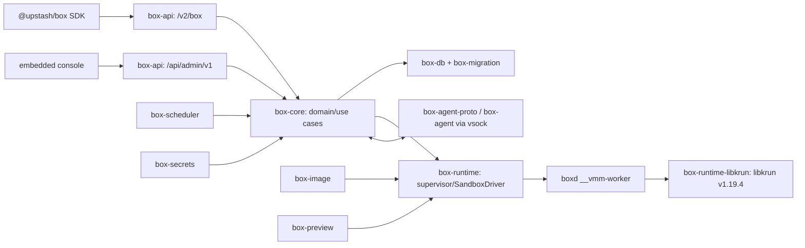

# Architecture

本页只整理 [development blueprint](../blueprint/boxd-development-blueprint.md) 已冻结的依赖和边界；不引入替代架构。

## Crate ownership

| Area | Frozen responsibility | Must not cross boundary |
|---|---|---|
| `boxd` | 唯一宿主二进制、CLI、composition root、隐藏 worker 子命令 | 不承载全部业务逻辑 |
| `box-api` | Salvo DTO、鉴权、调用 use case、响应映射 | 不直连 SeaORM、磁盘或 libkrun FFI |
| `box-core` | domain、ports、use cases、状态机 | 不依赖具体数据库或 VMM 设备实现 |
| `box-db` / `box-migration` | SeaORM repository 与三数据库迁移 | 不由 handler 直接访问 |
| `box-runtime` | `SandboxDriver`、supervisor、运行时端口 | 不向 domain/API 泄漏驱动实现细节 |
| `box-runtime-libkrun` | 唯一 libkrun FFI、worker spec、平台适配 | 不让 FFI/unsafe 扩散到其他 crate |
| `box-agent-proto` / `box-agent` | 显式版本化 protobuf、guest PID 1/service | 不暴露 guest root shell 或宿主 FD |
| `box-image` | runtime 下载、签名/校验、base raw clone | 不将宿主 workspace 作为默认 guest 文件系统 |
| `box-preview` | HTTP/WS/TCP tunnel | 不暴露 control/agent vsock 端口 |
| `box-scheduler` | cron、webhook、lease | 不改变兼容 HTTP API |
| `box-browser` | Chromium/CDP/recording（后续阶段） | 不穿透 Playwright DTO 到兼容 API |
| `box-secrets` | 加密与 redaction | 不让 secret 出现在日志、SSE 或诊断包 |

## Process and storage boundaries

`boxd serve` 是控制面。每个活跃 Box 是独立 `__vmm-worker` 子进程和独立 microVM；worker 的 VM 退出不能结束控制面。控制面持有业务状态、DB 和 RPC；worker 只配置并启动 VM，然后回传退出状态。

base `rootfs.raw` 只读；每个 Box 只有自己的 raw ext4 可写盘。guest 与宿主通过 vsock/Unix socket 与版本化 agent 协议通信，默认不共享宿主目录。

Phase 1 restricted-default egress 的 Accepted 数据面与 fail-closed 边界见
[ADR-0006](adr/0006-restricted-default-egress.md)。它继续使用显式 virtio-net，禁止
未过滤 TSI；macOS HVF lifecycle/restart 已验收，Linux KVM 仍须独立执行同一门禁。

## Normative ADRs

- [ADR-0001: libkrun 与 worker 生命周期](adr/0001-libkrun-worker-lifecycle.md)
- [ADR-0002: raw ext4 私有盘](adr/0002-raw-ext4-private-disks.md)
- [ADR-0003: MVP network policy](adr/0003-mvp-network-policy.md)
- [ADR-0004: 单可执行文件与 runtime bundle](adr/0004-single-executable-runtime-bundles.md)
- [ADR-0005: pinned SDK 源码基线](adr/0005-pinned-sdk-source-baseline.md)
- [ADR-0006: 受限默认 egress 用户态数据面](adr/0006-restricted-default-egress.md)

## Verification boundary

Phase 0 已完成；当前宿主机的 macOS Phase 1 lifecycle、受限默认 egress 与
`deny-all` 已有真实 HVF/restart 证据并完成本轮验收。Linux KVM 与十 runtime 矩阵
作为后续 TODO 保留，不据此宣称跨平台发布。详见
[implementation status](implementation-status.md) 和
[Linux validation TODO](linux-validation-todo.md)。
